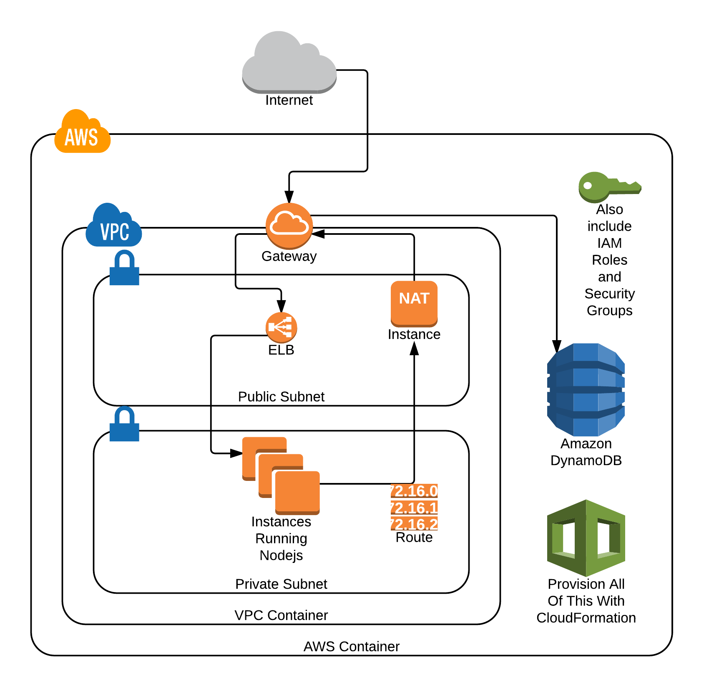

# CloudFormation-VPC
 cloudacademy lab
 
 AWS CloudFormation can be used to automatically provision your AWS resources across multiple accounts and regions all from a simple text file. 
 
 The CloudFormation template will describe all of your resources that you need, and their configurations without having to worry about service dependency.

# Reference
https://docs.aws.amazon.com/AWSCloudFormation/latest/UserGuide/aws-template-resource-type-ref.html
